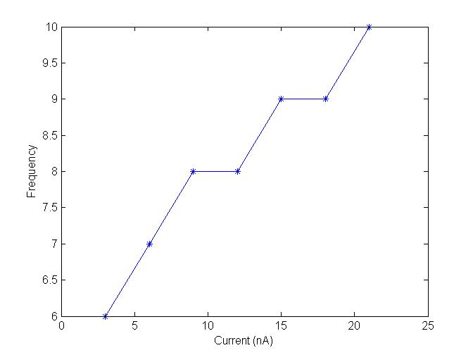

**Current frequency relationship**

Electrically excitable cells (also called neurons) generate a series of voltage pulses in responses to different input as currents. These responses or electrical signals are also called action potentials or spikes which are usually originate near the soma and propagate through the axon with constant velocity and amplitude.

Current-clamp is a method of intracellular recording involving measurement of the voltage difference across the cellular membrane while injecting constant positive or negative current (as "square" d.c. pulses) into the cell. Intracellular recordings from neurons are measured using a micro-electrode whose tip is about one micron diameter. When a microelectrode is inserted into a nerve cell as a response the polarity difference can be observed by a sharp change in the potential from 0 mV to -60 mV, the resting potential of the cell. The potential which is recorded when a living cell is at rest (not receiving any stimuli) is called resting potential. Usually it ranges from -80 mV to -40 mV depending upon the type of nerve cell. In the absence of any stimuli the membrane potential of the cell is generally constant.

 
 
&nbsp;

 

 

Fig 1. Schematic representation of current clamp experimental setup (left). Cartoon representation of membrane voltage recording at soma, a ‘bunch’ of spikes (also called burst) in response to current as input into the dendrites (right).

 

Neurophysiologists use current clamp technique to study how a cell responds to an applied electric current (stimuli) and these characteristics of a neuron (electrically excitable cell) depends on the membrane properties and channel kinetics.In order to understand the behavior of the cell, one has to study the  relationship between the stimuli and the response by applying a series of input stimuli with varying amplitude of current (ranges of nano amperes) (see Fig. 1). Here in this study we simulate a current clamp protocol by injecting 1 nA - 20 nA current to a Hodgkin Huxley neuron model (see Table 1, Fig 2) which is modeled along with the simulator.

 

 
&nbsp;

 

 

Table 1. Listed are the injected input current and frequency of spike measured from a Hodgkin Huxley neuron using the simulator.

 

 

 
&nbsp;

 

 

Fig 2. Frequency-vs-Current injected plot (plotted using Matlab)
